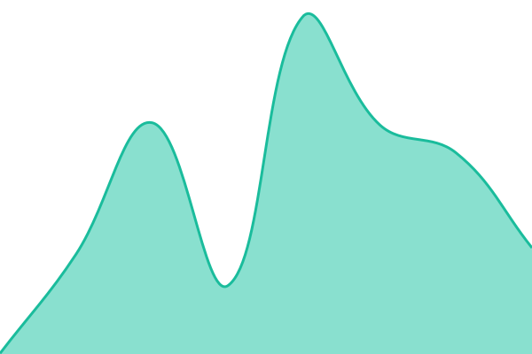
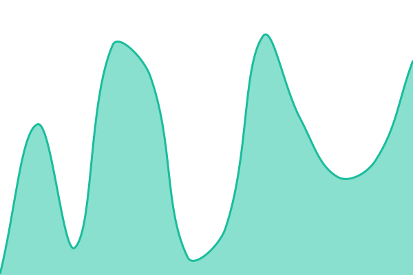
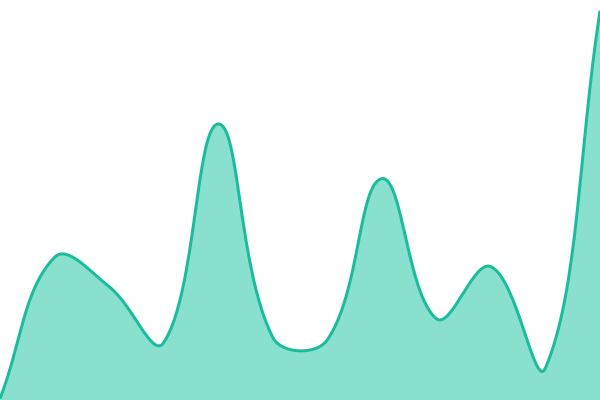

# [📈 Live Status](https://status.adrianwedd.com): <!--live status--> **All systems operational**

This repository contains the open-source uptime monitor and status page for [Adrian Wedd](https://adrianwedd.com), powered by [Upptime](https://github.com/upptime/upptime).

With [Upptime](https://upptime.js.org), you can get your own unlimited and free uptime monitor and status page, powered entirely by a GitHub repository. We use [Issues](https://github.com/adrianwedd/upptime/issues) as incident reports, [Actions](https://github.com/adrianwedd/upptime/actions) as uptime monitors, and [Pages](https://status.adrianwedd.com) for the status page.

<!--start: status pages-->
<!-- This summary is generated by Upptime (https://github.com/upptime/upptime) -->
<!-- Do not edit this manually, your changes will be overwritten -->
<!-- prettier-ignore -->
| URL | Status | History | Response Time | Uptime |
| --- | ------ | ------- | ------------- | ------ |
|  [adrianwedd.com](https://adrianwedd.com) | 🟩 Up | [adrianwedd-com.yml](https://github.com/adrianwedd/status/commits/HEAD/history/adrianwedd-com.yml) | 

 215ms
     
 | 

<a href="https://status.adrianwedd.com/history/adrianwedd-com">100.00%</a>
    

|  [adrianwedd.com CDN](https://cdn.adrianwedd.com/test-api-upload.txt) | 🟩 Up | [adrianwedd-com-cdn.yml](https://github.com/adrianwedd/status/commits/HEAD/history/adrianwedd-com-cdn.yml) | 

 203ms
     
 | 

<a href="https://status.adrianwedd.com/history/adrianwedd-com-cdn">100.00%</a>
    

|  [adrianwedd.com Sitemap](https://adrianwedd.com/sitemap-index.xml) | 🟩 Up | [adrianwedd-com-sitemap.yml](https://github.com/adrianwedd/status/commits/HEAD/history/adrianwedd-com-sitemap.yml) | 

 140ms
     
 | 

<a href="https://status.adrianwedd.com/history/adrianwedd-com-sitemap">100.00%</a>
    

|  [adrianwedd.com Podcast RSS](https://adrianwedd.com/audio/feed.xml) | 🟩 Up | [adrianwedd-com-podcast-rss.yml](https://github.com/adrianwedd/status/commits/HEAD/history/adrianwedd-com-podcast-rss.yml) | 

 144ms
     
 | 

<a href="https://status.adrianwedd.com/history/adrianwedd-com-podcast-rss">100.00%</a>
    

|  [adrianwedd.com Blog RSS](https://adrianwedd.com/blog/rss.xml) | 🟩 Up | [adrianwedd-com-blog-rss.yml](https://github.com/adrianwedd/status/commits/HEAD/history/adrianwedd-com-blog-rss.yml) | 

 134ms
     
 | 

<a href="https://status.adrianwedd.com/history/adrianwedd-com-blog-rss">100.00%</a>
    

|  [Social Worker](https://social.adrianwedd.com/api/health) | 🟩 Up | [social-worker.yml](https://github.com/adrianwedd/status/commits/HEAD/history/social-worker.yml) | 

 1540ms
     
 | 

<a href="https://status.adrianwedd.com/history/social-worker">99.53%</a>
    

|  [Contact Page](https://adrianwedd.com/contact/) | 🟩 Up | [contact-page.yml](https://github.com/adrianwedd/status/commits/HEAD/history/contact-page.yml) | 

 167ms
     
 | 

<a href="https://status.adrianwedd.com/history/contact-page">100.00%</a>
    

|  [Booking Page](https://book.adrianwedd.com) | 🟩 Up | [booking-page.yml](https://github.com/adrianwedd/status/commits/HEAD/history/booking-page.yml) | 

 167ms
     
 | 

<a href="https://status.adrianwedd.com/history/booking-page">100.00%</a>
    

|  [Booking API (slots)](https://api.book.adrianwedd.com/slots?date=2030-01-01) | 🟩 Up | [booking-api-slots.yml](https://github.com/adrianwedd/status/commits/HEAD/history/booking-api-slots.yml) | 

 401ms
     
 | 

<a href="https://status.adrianwedd.com/history/booking-api-slots">100.00%</a>
    

|  [Booking API (Gmail health)](https://api.book.adrianwedd.com/health) | 🟩 Up | [booking-api-gmail-health.yml](https://github.com/adrianwedd/status/commits/HEAD/history/booking-api-gmail-health.yml) | 

 222ms
     
 | 

<a href="https://status.adrianwedd.com/history/booking-api-gmail-health">100.00%</a>
    

|  [Ops Worker (enquiry API)](https://ops.adrianwedd.com/api/health) | 🟩 Up | [ops-worker-enquiry-api.yml](https://github.com/adrianwedd/status/commits/HEAD/history/ops-worker-enquiry-api.yml) | 

 147ms
     
 | 

<a href="https://status.adrianwedd.com/history/ops-worker-enquiry-api">100.00%</a>
    

|  [Xero Connection (ops)](https://ops.adrianwedd.com/api/health/xero) | 🟩 Up | [xero-connection-ops.yml](https://github.com/adrianwedd/status/commits/HEAD/history/xero-connection-ops.yml) | 

 188ms
     
 | 

<a href="https://status.adrianwedd.com/history/xero-connection-ops">100.00%</a>
    

|  [SPARK (site)](https://spark.wedd.au) | 🟩 Up | [spark-site.yml](https://github.com/adrianwedd/status/commits/HEAD/history/spark-site.yml) | 

 191ms
     
 | 

<a href="https://status.adrianwedd.com/history/spark-site">100.00%</a>
    

|  [SPARK API (status)](https://spark-api.wedd.au/api/v1/public/status) | 🟩 Up | [spark-api-status.yml](https://github.com/adrianwedd/status/commits/HEAD/history/spark-api-status.yml) | 

 872ms
     
 | 

<a href="https://status.adrianwedd.com/history/spark-api-status">100.00%</a>
    

|  [Minecraft Status (site)](https://minecraft.wedd.au) | 🟩 Up | [minecraft-status-site.yml](https://github.com/adrianwedd/status/commits/HEAD/history/minecraft-status-site.yml) | 

 768ms
     
 | 

<a href="https://status.adrianwedd.com/history/minecraft-status-site">100.00%</a>
    

|  [Minecraft Status (API)](https://minecraft.wedd.au/api/status) | 🟩 Up | [minecraft-status-api.yml](https://github.com/adrianwedd/status/commits/HEAD/history/minecraft-status-api.yml) | 

 674ms
     
 | 

<a href="https://status.adrianwedd.com/history/minecraft-status-api">100.00%</a>
    

|  [Evolve Chiropractic](https://evolvechiropractictas.com) | 🟩 Up | [evolve-chiropractic.yml](https://github.com/adrianwedd/status/commits/HEAD/history/evolve-chiropractic.yml) | 

 183ms
     
 | 

<a href="https://status.adrianwedd.com/history/evolve-chiropractic">100.00%</a>
    

|  [Evolve Hub](https://evolve.adrianwedd.com) | 🟩 Up | [evolve-hub.yml](https://github.com/adrianwedd/status/commits/HEAD/history/evolve-hub.yml) | 

 156ms
     
 | 

<a href="https://status.adrianwedd.com/history/evolve-hub">100.00%</a>
    

|  [Tanda Pizza](https://tandapizza.com) | 🟩 Up | [tanda-pizza.yml](https://github.com/adrianwedd/status/commits/HEAD/history/tanda-pizza.yml) | 

 168ms
     
 | 

<a href="https://status.adrianwedd.com/history/tanda-pizza">100.00%</a>
    

|  [Annica Larsdotter](https://annicalarsdotter.com) | 🟩 Up | [annica-larsdotter.yml](https://github.com/adrianwedd/status/commits/HEAD/history/annica-larsdotter.yml) | 

 237ms
     
 | 

<a href="https://status.adrianwedd.com/history/annica-larsdotter">100.00%</a>
    

|  [True Capacity Coaching](https://truecapacity.coach) | 🟩 Up | [true-capacity-coaching.yml](https://github.com/adrianwedd/status/commits/HEAD/history/true-capacity-coaching.yml) | 

 334ms
     
 | 

<a href="https://status.adrianwedd.com/history/true-capacity-coaching">100.00%</a>
    

|  [Link Redirects (worker-links)](https://gh.adrianwedd.com) | 🟩 Up | [link-redirects-worker-links.yml](https://github.com/adrianwedd/status/commits/HEAD/history/link-redirects-worker-links.yml) | 

 545ms
     
 | 

<a href="https://status.adrianwedd.com/history/link-redirects-worker-links">100.00%</a>
    

|  [The Ungovernable Body](https://ungovernable-body.wedd.au) | 🟩 Up | [the-ungovernable-body.yml](https://github.com/adrianwedd/status/commits/HEAD/history/the-ungovernable-body.yml) | 

 180ms
     
 | 

<a href="https://status.adrianwedd.com/history/the-ungovernable-body">100.00%</a>
    

|  [Failure First](https://failurefirst.org) | 🟩 Up | [failure-first.yml](https://github.com/adrianwedd/status/commits/HEAD/history/failure-first.yml) | 

 278ms
     
 | 

<a href="https://status.adrianwedd.com/history/failure-first">100.00%</a>
    

|  [This Wasn't in the Brochure](https://thiswasntinthebrochure.wtf) | 🟩 Up | [this-wasn-t-in-the-brochure.yml](https://github.com/adrianwedd/status/commits/HEAD/history/this-wasn-t-in-the-brochure.yml) | 

 0ms
     
 | 

<a href="https://status.adrianwedd.com/history/this-wasn-t-in-the-brochure">100.00%</a>
    

|  [Before the Words Existed](https://adrianwedd.github.io/before-the-words-existed/) | 🟩 Up | [before-the-words-existed.yml](https://github.com/adrianwedd/status/commits/HEAD/history/before-the-words-existed.yml) | 

 89ms
     
 | 

<a href="https://status.adrianwedd.com/history/before-the-words-existed">100.00%</a>
    

|  [Living CV](https://adrianwedd.github.io/cv/) | 🟩 Up | [living-cv.yml](https://github.com/adrianwedd/status/commits/HEAD/history/living-cv.yml) | 

 230ms
     
 | 

<a href="https://status.adrianwedd.com/history/living-cv">100.00%</a>
    

|  [Anthropic (Claude)](https://status.claude.com) | 🟩 Up | [anthropic-claude.yml](https://github.com/adrianwedd/status/commits/HEAD/history/anthropic-claude.yml) | 

 123ms
     
 | 

<a href="https://status.adrianwedd.com/history/anthropic-claude">100.00%</a>
    

|  [OpenAI](https://status.openai.com) | 🟩 Up | [open-ai.yml](https://github.com/adrianwedd/status/commits/HEAD/history/open-ai.yml) | 

 732ms
     
 | 

<a href="https://status.adrianwedd.com/history/open-ai">100.00%</a>
    

|  [Google Cloud](https://status.cloud.google.com) | 🟩 Up | [google-cloud.yml](https://github.com/adrianwedd/status/commits/HEAD/history/google-cloud.yml) | 

 169ms
     
 | 

<a href="https://status.adrianwedd.com/history/google-cloud">100.00%</a>
    

|  [GitHub](https://www.githubstatus.com) | 🟩 Up | [git-hub.yml](https://github.com/adrianwedd/status/commits/HEAD/history/git-hub.yml) | 

 107ms
     
 | 

<a href="https://status.adrianwedd.com/history/git-hub">100.00%</a>
    

|  [Cloudflare](https://www.cloudflarestatus.com) | 🟩 Up | [cloudflare.yml](https://github.com/adrianwedd/status/commits/HEAD/history/cloudflare.yml) | 

 190ms
     
 | 

<a href="https://status.adrianwedd.com/history/cloudflare">100.00%</a>
    

|  [npm](https://status.npmjs.org) | 🟩 Up | [npm.yml](https://github.com/adrianwedd/status/commits/HEAD/history/npm.yml) | 

 191ms
     
 | 

<a href="https://status.adrianwedd.com/history/npm">100.00%</a>
    

|  [Status Page](https://status.adrianwedd.com) | 🟩 Up | [status-page.yml](https://github.com/adrianwedd/status/commits/HEAD/history/status-page.yml) | 

 150ms
     
 | 

<a href="https://status.adrianwedd.com/history/status-page">100.00%</a>
    

<!--end: status pages-->

[**Visit our status website →**](https://status.adrianwedd.com)

## 📄 License

- Powered by: [Upptime](https://github.com/upptime/upptime)
- Code: [MIT](./LICENSE) © [Anand Chowdhary](https://anandchowdhary.com), supported by [Pabio](https://pabio.com)
- Data in the `./history` directory: [Open Database License](https://opendatacommons.org/licenses/odbl/1-0/)
